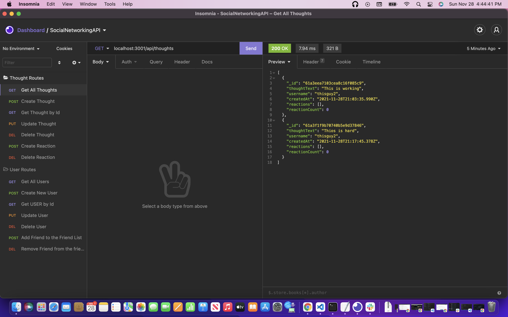

# Social Network API

## Description 

This is an application that is the beginning stages of a social network application. This application uses MongoDB, and the library Mongoose.js to allow MongoDB and Express.js to connect in a way that is great for the user. These two can make different CRUD requests to interact with a database. Object-Document Mapping allows a developer to create very complex interactions with the databases and not having to worry about messing up different databases. Developers can have the freedom to make changes without having to write over the code in a structured database. 

If you have an questions about how to start the project, please follow the video below to see.
https://drive.google.com/file/d/1N8Rvu8qfVxOZel5SkcBGvKN6ygBk3vfJ/view

## Table of Contents

* [Installation](#installation)
* [Usage](#usage)
* [Technologies](#technologies)
* [License](license)
* [Credit](#credit)

## Installation
Before you begin you should have Node.js and Mongo installed along with VS Code and Insomnia.

1. At the location of the Github repo, click on the green button. 

2. Click on the SSH, and copy the link that pops up. 

3. Have a new folder on your desktop that is unused and open Terminal or Git Bash.

4. Navigate to the folder in your terminal and type `git clone`. Then paste the link you copied. 

5. Then go into the folder and navigate to the root folder of the project. 

6. Install the dependencies that you need for this project by typing in `npm install`. For a more in depth review or help watch the video above or feel free to contact myself at the different ways below. 

## Usage

To use this application, make sure you have an API client (Insomnia is what I use and recommend)

1. Make sure you are in the root folder of the project, `social-network-API` is this one. 

2. When you are in the terminal make sure you run `npm start`. This will start the server and bring you to local host 3001. 

3. Open your choice of API client and you can run from there. If you look at the screenshot above it can help with the different API routes that you can run. Also the walk through video can help give you an idea of the routes and how to get started. 

## Technologies

* MongoDB
* Mongoose
* Node.js
* Express.js

## License

MIT License

## Credits

* UCONN Coding Bootcamp